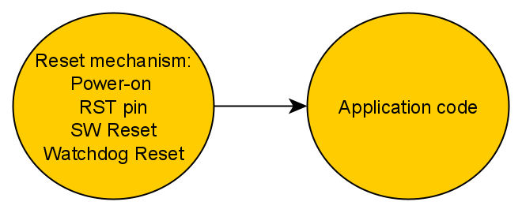
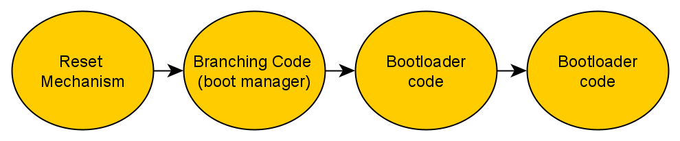
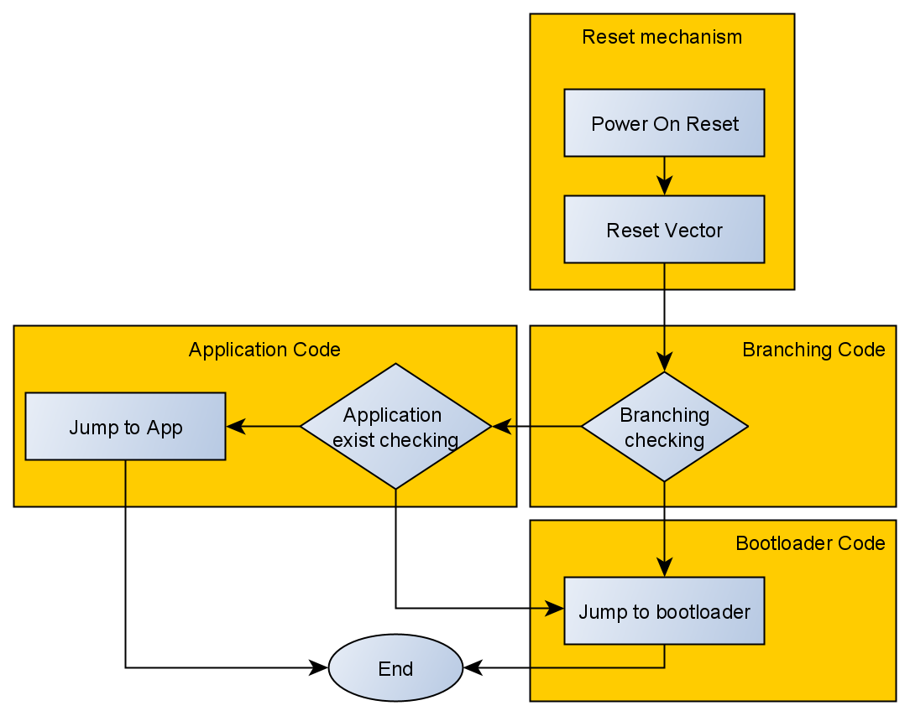

## Acknowledgment
<a href="https://youtube.com/playlist?list=PLl3yF2kjT6AzLxhOuCEBY-8RzOIB1sfnN">Embedded bootloader design YouTube playlist</a>

## Bootloader fundementals

### What the bootloader.
- Bootloader is a code provides a method to program and update MCU flash without using specific hardware programming tool like JTAG.
- Bootloader may update the MCU flash remotely (most common) or locally. 
- Bootloader code stored in ROM or Protected flash to avoid accidental overwriting.

### Why the bootloader.
- Bootloader needed to upgrade product's system when bug are found.
- To upgrade the product's system when the new feature is added.
- Assuming that the product is deployed and we published 30 thousand devices.

### Booting conditions.
- There exist two modes: the application and the boot modes.
- To switch from the application mode to boot mode:
  - The manual conditions: push button signal for 3 seconds, or USB signal etc.
  - The automatic conditions: receiving specific packet for update new version or updating using communication interfaces.

### System components without bootloader.
<figure>
  
  <figcaption>System components without bootloader</figcaption>
</figure>

### System components with bootloader.
<figure>
  
  <figcaption>System components with bootloader</figcaption>
</figure>

- Branching code (boot manager)
    - decides to go for bootloader code or application code. 
    - The code can have a seperate section in memory or share the same section of the bootloader.
    - It checks on non-volatile memory location. If location x has 1, then jump to the bootloader code, otherwise jump to application code.
    - Checking for timeout (checking for the non-volatile memory).
- Bootloader code verify and update.
- Application code
    - Receiving new image
    - Perform main functionality.

### Bootloader general sequence.
<figure>
  
  <figcaption>bootloader sequence</figcaption>
</figure>

- Note: it's not prefered to use flash memory in branching code to store the check flag, because you can't write just one word, you can write an entire sector which will lead to wasted space. Instead, you can use EEPROM.

- Application checking
    1. CRC checking
    1. Flash erasing checking
    1. Image verification flag
    1. etc.

### Embedded bootloader types (providing)

- vendor bootloader
- custom bootloader
- both vendor and custom bootloader

- Note: In case of existing vendor bootloader and you want to add your custom bootloader, it will be added in flash. And you should adjust the <code>Vector Table Offset Register</code> to point to the new application program which starts with the vector table.

- There's pins for determining the booting mode (Vendor, flash, SRAM), typically they are two pins. The MCU remap the physical address of the chosen memory to the right place, for example if the flash mode is used the MCU will remap the start of the custom bootloader in the flash memory to address 0x0 for arm-cortex-m CPUs.

## bootloader design considerations.

### Why application code receives the image and not the bootloader ?!

- Problem: Suppose your bootloader receives the image using Wireless communication. So, there should be a wireless stack in the bootloader section. At the same time, the application code uses wireless, so it also needs wireless stack. In case of receiving the image in the bootloader section, there will be <strong>duplication</strong>.
- Solution: make the application code receive the image, so just one wireless stack exist in the flash memory. At this case the bootloader is called bootstrap.

- Problem: what if the application code is corrupted for some reason ?
- Solution: make the communication stack (e.g. wireless stack) a shared library within a specific section.

- Problem: what if the application code doesn't exist yet ?
- Solution: the bootloader is the one who's responsible for receiving the image using the shared communication stack.
